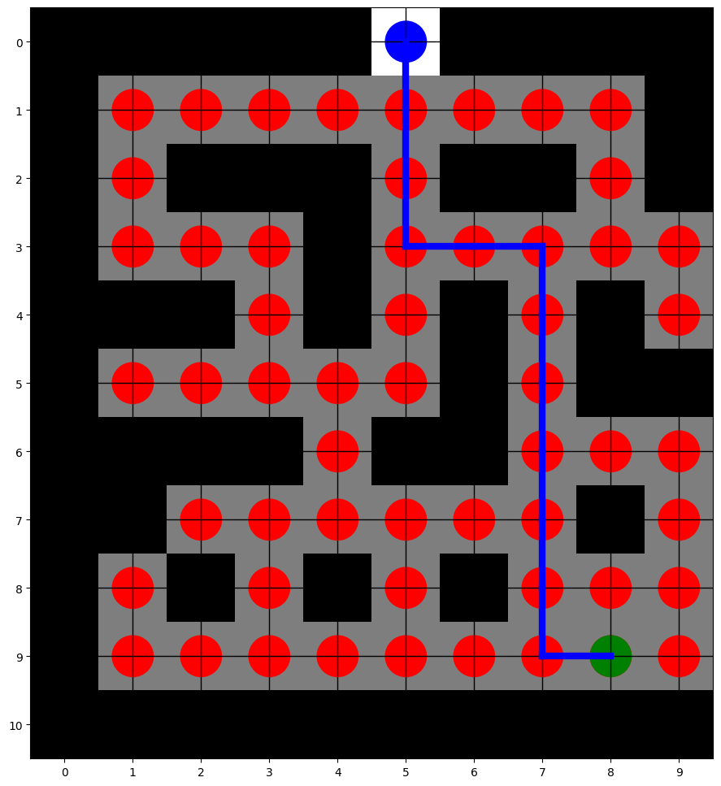

### Q-Learning Maze Solver

This repository contains a Q-learning-based approach to solve a maze problem. The algorithm enables an autonomous agent to navigate through a maze and find the optimal path to a designated exit.

---

## Project Overview

The Q-learning algorithm is applied in this project to train a robot agent to find the shortest path through a maze. The maze is represented as a grid where:
- `-100` denotes walls (impassable obstacles),
- `-1` represents free paths,
- `100` signifies the exit point.

During training, the agent explores different paths and updates its Q-values based on rewards and penalties. The Q-values help the agent learn an optimal policy to reach the exit with the least number of moves.

## How It Works

1. **Maze Matrix**: The maze is defined as a matrix, where different values represent walls, open paths, and the exit.
2. **Agent Actions**: The agent can move in four directions: Right, Left, Up, and Down.
3. **Training**: Using Q-learning, the agent explores the maze, adjusting its Q-values based on movement outcomes.
4. **Shortest Path Calculation**: After training, the agent can calculate the shortest path from a given starting point to the exit.

## Key Files

- `qlearning.ipynb`: The main code file containing the Q-learning implementation, training loop, and visualization of the maze and the shortest path.
- `maze.py` (optional): A helper file for defining custom maze configurations.

## Usage

1. **Define Starting Point**: Run the script and enter the coordinates for the agent’s starting point in the maze.
2. **Training**: The algorithm runs for a set number of episodes, updating Q-values and learning the optimal path.
3. **Display Route**: The computed shortest path from the starting point to the exit is displayed in the console and visualized using `matplotlib`.

## Output Example

```
Maze:
[[-100 -100 -100 -100 -100  100 -100 -100 -100 -100]
 [-100   -1   -1   -1   -1   -1   -1   -1   -1 -100]
 [-100   -1 -100 -100 -100   -1 -100 -100   -1 -100]
 [-100   -1   -1   -1 -100   -1   -1   -1   -1   -1]
 [-100 -100 -100   -1 -100   -1 -100   -1 -100   -1]
 [-100   -1   -1   -1   -1   -1 -100   -1 -100 -100]
 [-100 -100 -100 -100   -1 -100 -100   -1   -1   -1]
 [-100 -100   -1   -1   -1   -1   -1   -1 -100   -1]
 [-100   -1 -100   -1 -100   -1 -100   -1   -1   -1]
 [-100   -1   -1   -1   -1   -1   -1   -1   -1   -1]
 [-100 -100 -100 -100 -100 -100 -100 -100 -100 -100]]
Training completed.
Enter the robot's starting point (e.g., 0 0): 9 8
Route to the exit:
[9, 8]
[9, 7]
[8, 7]
...
```
### Solved Maze Example

Below is an example of the solved maze generated by the Q-learning algorithm:



## Requirements

- Python 3.x
- `numpy`
- `matplotlib`

## Future Enhancements

- Support for variable-sized mazes.
- Enhanced training and exploration strategies to optimize learning speed.

---

This project provides a fundamental understanding of Q-learning and reinforcement learning in maze-solving applications. Happy exploring!
